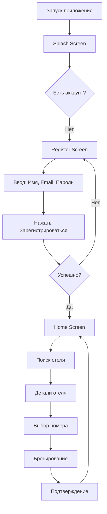
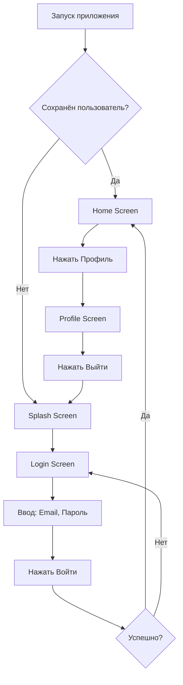
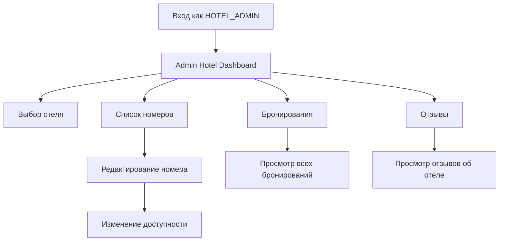
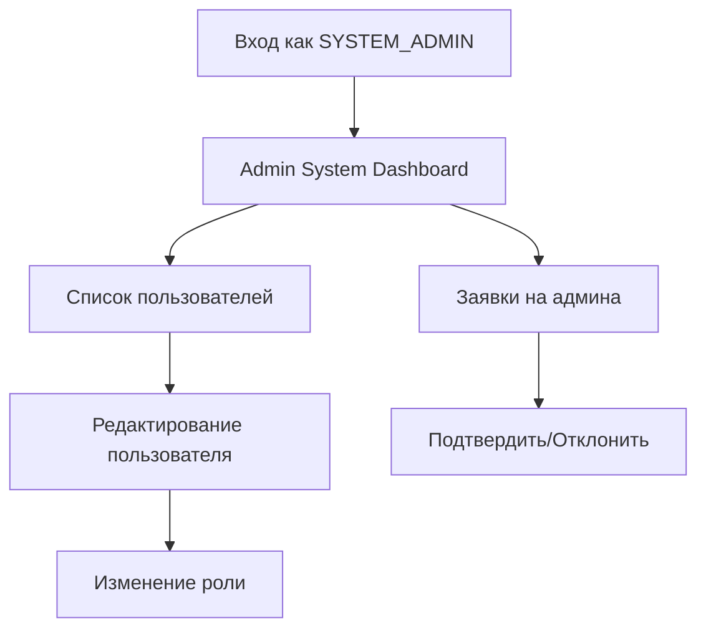

# Пользовательские сценарии (User Flow)

Этот документ описывает все пути пользователя в приложении HotelApp.

---

## Содержание

1. [Общая схема навигации](#общая-схема-навигации)
2. [Сценарий: Новый пользователь](#сценарий-новый-пользователь)
3. [Сценарий: Возвращающийся пользователь](#сценарий-возвращающийся-пользователь)
4. [Сценарий: Поиск и бронирование отеля](#сценарий-поиск-и-бронирование-отеля)
5. [Сценарий: Управление профилем](#сценарий-управление-профилем)
6. [Сценарий: Администратор отеля](#сценарий-администратор-отеля)
7. [Сценарий: Системный администратор](#сценарий-системный-администратор)
8. [Тестовые учётные записи](#тестовые-учётные-записи)

---

## Общая схема навигации

```
┌─────────────────────────────────────────────────────────────────┐
│                        СТАРТ ПРИЛОЖЕНИЯ                          │
└─────────────────────────────────────────────────────────────────┘
                              │
                              ▼
                    ┌─────────────────┐
                    │  Проверка       │
                    │  авторизации    │
                    └─────────────────┘
                              │
              ┌───────────────┼───────────────┐
              │               │               │
              ▼               ▼               ▼
    ┌─────────────────┐ ┌───────────┐ ┌─────────────┐
    │ Не авторизован  │ │  USER     │ │   ADMIN     │
    │                 │ │           │ │             │
    │  → Splash       │ │  → Home   │ │  → Dashboard│
    │  → Login        │ │           │ │             │
    │  → Register     │ │           │ │             │
    └─────────────────┘ └───────────┘ └─────────────┘
```

---

## Сценарий: Новый пользователь

### Путь: Регистрация → Поиск отеля → Бронирование



### Шаги:

1. **Запуск приложения**
   - Пользователь открывает приложение
   - Отображается Splash Screen с логотипом

2. **Регистрация**
   - Нажимает кнопку "Зарегистрироваться"
   - Переходит на экран регистрации
   - Вводит:
     - Имя (обязательно)
     - Email (обязательно)
     - Пароль (минимум 6 символов)
     - Подтверждение пароля
   - Нажимает "Зарегистрироваться"

3. **Валидация**
   - Если email уже существует → ошибка
   - Если пароли не совпадают → ошибка
   - Если все верно → автоматическая авторизация

4. **Переход к поиску**
   - После успешной регистрации → переход на Home Screen
   - Доступен полный функционал приложения

---

## Сценарий: Возвращающийся пользователь

### Путь: Авторизация → Просмотр профиля → Выход



### Шаги:

1. **Автоматическая авторизация**
   - При запуске проверяется EncryptedSharedPreferences
   - Если пользователь сохранён → переход на Home Screen
   - Если нет → Splash Screen

2. **Ручная авторизация**
   - Ввод email и пароля
   - Нажатие кнопки "Войти"
   - При успехе → переход на Home Screen
   - При ошибке → сообщение об ошибке

3. **Просмотр профиля**
   - Нажатие иконки профиля в TopBar
   - Отображение:
     - Аватар (заглушка)
     - Имя и email
     - Роль пользователя
     - Меню действий

4. **Выход из системы**
   - Нажатие кнопки "Выйти" в профиле
   - Очистка сохранённых данных
   - Переход на Splash Screen

---

## Сценарий: Поиск и бронирование отеля

### Полный путь пользователя

```
┌─────────────────────────────────────────────────────────────────┐
│                        HOME SCREEN                               │
│  ┌─────────────────────────────────────────────────────────┐    │
│  │  TopBar: HotelApp  [🔍] [👤] [🚪]                       │    │
│  ├─────────────────────────────────────────────────────────┤    │
│  │  Популярные направления:                                 │    │
│  │  [Все] [Москва] [Сочи] [Домбай] [...]                   │    │
│  ├─────────────────────────────────────────────────────────┤    │
│  │  Отели:                                                  │    │
│  │  ┌───────────────────────────────────────────────────┐  │    │
│  │  │ [Фото отеля]                                      │  │    │
│  │  │ Grand Palace Hotel                    ⭐ 4.8 (324)│  │    │
│  │  │ 📍 Москва • Отель                                 │  │    │
│  │  │ Роскошный 5-звездочный отель в центре...          │  │    │
│  │  │ от 15000 ₽ за ночь              [Подробнее]       │  │    │
│  │  └───────────────────────────────────────────────────┘  │    │
│  │  [...]                                                   │    │
│  └─────────────────────────────────────────────────────────┘    │
└─────────────────────────────────────────────────────────────────┘
                            │
                            │ Нажать "Подробнее"
                            ▼
┌─────────────────────────────────────────────────────────────────┐
│                     HOTEL DETAILS SCREEN                         │
│  ┌─────────────────────────────────────────────────────────┐    │
│  │  [←]                                                    │    │
│  ├─────────────────────────────────────────────────────────┤    │
│  │  [Фото отеля]                                            │    │
│  │  Grand Palace Hotel                          ⭐ 4.8 (324)│    │
│  │  📍 Москва • Отель                                       │    │
│  ├─────────────────────────────────────────────────────────┤    │
│  │  Описание:                                               │    │
│  │  Роскошный 5-звездочный отель в самом центре Москвы...   │    │
│  ├─────────────────────────────────────────────────────────┤    │
│  │  Удобства: [▼]                                           │    │
│  │  • Wi-Fi  • Бассейн  • Спа  • Ресторан  • ...           │    │
│  ├─────────────────────────────────────────────────────────┤    │
│  │  Отзывы (324)                        [Читать все отзывы] │    │
│  │  ┌─────────────────────────────────────────────────┐    │    │
│  │  │ Александр М.                          ⭐⭐⭐⭐⭐     │    │    │
│  │  │ "Превосходный отель! Обслуживание на..."        │    │    │
│  │  └─────────────────────────────────────────────────┘    │    │
│  ├─────────────────────────────────────────────────────────┤    │
│  │  [Выбрать номер →]                                       │    │
│  └─────────────────────────────────────────────────────────┘    │
└─────────────────────────────────────────────────────────────────┘
                            │
                            │ Нажать "Выбрать номер"
                            ▼
┌─────────────────────────────────────────────────────────────────┐
│                      ROOMS LIST SCREEN                           │
│  ┌─────────────────────────────────────────────────────────┐    │
│  │  [←]  Номера отеля                                      │    │
│  ├─────────────────────────────────────────────────────────┤    │
│  │  ┌───────────────────────────────────────────────────┐  │    │
│  │  │ [Фото номера]                                     │  │    │
│  │  │ Делюкс с видом на город                           │  │    │
│  │  │ Просторный номер площадью 45 м² с панорамными...  │  │    │
│  │  │ 👥 2 гостя  •  15000 ₽/ночь                       │  │    │
│  │  │ [Забронировать]                                   │  │    │
│  │  └───────────────────────────────────────────────────┘  │    │
│  │  ┌───────────────────────────────────────────────────┐  │    │
│  │  │ [Фото номера]                                     │  │    │
│  │  │ Представительский люкс                            │  │    │
│  │  │ Двухкомнатный номер площадью 80 м²...             │  │    │
│  │  │ 👥 4 гостя  •  35000 ₽/ночь                       │  │    │
│  │  │ [Забронировать]                                   │  │    │
│  │  └───────────────────────────────────────────────────┘  │    │
│  └─────────────────────────────────────────────────────────┘    │
└─────────────────────────────────────────────────────────────────┘
                            │
                            │ Нажать "Забронировать"
                            ▼
┌─────────────────────────────────────────────────────────────────┐
│                       BOOKING SCREEN                             │
│  ┌─────────────────────────────────────────────────────────┐    │
│  │  [←]  Бронирование номера                               │    │
│  ├─────────────────────────────────────────────────────────┤    │
│  │  Делюкс с видом на город                               │    │
│  │  Grand Palace Hotel                                    │    │
│  ├─────────────────────────────────────────────────────────┤    │
│  │  Дата заезда:    [15.02.2025 ▼]                        │    │
│  │  Дата выезда:    [17.02.2025 ▼]                        │    │
│  │  Гости:          [2 ▼]                                 │    │
│  ├─────────────────────────────────────────────────────────┤    │
│  │  2 ночи × 15000 ₽ = 30000 ₽                            │    │
│  ├─────────────────────────────────────────────────────────┤    │
│  │  [Подтвердить бронирование]                            │    │
│  └─────────────────────────────────────────────────────────┘    │
└─────────────────────────────────────────────────────────────────┘
                            │
                            │ Нажать "Подтвердить"
                            ▼
┌─────────────────────────────────────────────────────────────────┐
│                    ПОДТВЕРЖДЕНИЕ                                 │
│  ┌─────────────────────────────────────────────────────────┐    │
│  │  ✅ Бронирование подтверждено!                          │    │
│  │  Номер: Делюкс с видом на город                         │    │
│  │  Даты: 15.02.2025 - 17.02.2025                          │    │
│  │  Сумма: 30000 ₽                                         │    │
│  │  [Вернуться на главную]                                 │    │
│  └─────────────────────────────────────────────────────────┘    │
└─────────────────────────────────────────────────────────────────┘
```

---

## Сценарий: Управление профилем

### Путь: Просмотр → История → Уведомления → Настройки

```
Home Screen
    │
    ├─→ [👤 Профиль]
    │       │
    │       ├─→ [История бронирований]
    │       │       │
    │       │       ├─→ Активные бронирования
    │       │       │       └─→ [Отменить] / [Оценить]
    │       │       │
    │       │       └─→ Завершённые бронирования
    │       │               └─→ [Оценить отель]
    │       │
    │       ├─→ [Уведомления] 🔴 2
    │       │       │
    │       │       ├─→ "Бронирование подтверждено"
    │       │       ├─→ "Напоминание о поездке"
    │       │       └─→ [Отметить как прочитанное]
    │       │
    │       └─→ [Настройки]
    │               │
    │               ├─→ Изменить пароль
    │               ├─→ Уведомления
    │               └─→ [Выйти]
    │
    └─→ [🚪 Выйти] (быстрый выход из TopBar)
```

### Экран истории бронирований

| Статус | Действия |
|--------|----------|
| **Активные** | Отменить, Оценить |
| **Завершённые** | Оценить |
| **Отменённые** | — |

---

## Сценарий: Администратор отеля

### Путь: Вход → Панель управления → Управление номерами



### Доступные действия:

| Экран | Действия |
|-------|----------|
| **Dashboard** | Выбор отеля, общая статистика |
| **Номера** | Просмотр списка, редактирование |
| **Редактирование** | Изменение цены, описания, доступности |
| **Бронирования** | Просмотр всех бронирований отеля |
| **Отзывы** | Просмотр отзывов (без ответа) |

---

## Сценарий: Системный администратор

### Путь: Вход → Панель → Управление пользователями



### Доступные действия:

| Экран | Действия |
|-------|----------|
| **Dashboard** | Общая статистика системы |
| **Пользователи** | Просмотр всех, редактирование ролей |
| **Заявки** | Подтверждение/отклонение заявок на админа |

### Роли для назначения:

- **USER** → обычный пользователь
- **HOTEL_ADMIN** → администратор отеля
- **SYSTEM_ADMIN** → системный администратор

---

## Тестовые учётные записи

Для тестирования всех сценариев используйте следующие учётные данные:

| Email | Пароль | Роль | Описание |
|-------|--------|------|----------|
| `user@example.com` | `123456` | USER | Обычный пользователь |
| `hotel@admin.com` | `123456` | HOTEL_ADMIN | Администратор отеля |
| `system@admin.com` | `123456` | SYSTEM_ADMIN | Системный администратор |

### Проверка сохранения пользователя

1. Войдите под любой учётной записью
2. Закройте приложение полностью
3. Откройте приложение снова
4. **Ожидаемый результат:** автоматический вход без запроса пароля
5. Для выхода: Профиль → Выйти (или иконка выхода в TopBar)

---

## Обработка ошибок

### Сценарии ошибок и поведение

| Ситуация | Сообщение | Действие |
|----------|-----------|----------|
| Неверный email/пароль | "Неверный email или пароль" | Остаться на экране входа |
| Email уже существует | "Пользователь с таким email уже существует" | Остаться на регистрации |
| Пароли не совпадают | "Пароли не совпадают" | Остаться на регистрации |
| Пароль < 6 символов | "Пароль должен содержать минимум 6 символов" | Остаться на регистрации |
| Пользователь не найден в профиле | "Пользователь не авторизован" | Редирект на Splash |
| Дата заезда в прошлом | "Дата заезда не может быть в прошлом" | Не давать выбрать дату |
| Дата выезда раньше заезда | "Дата выезда должна быть позже даты заезда" | Не давать выбрать дату |

---

## Состояния загрузки

Все экраны отображают `CircularProgressIndicator` во время загрузки данных:

- Home Screen → загрузка списка отелей
- Hotel Details → загрузка деталей отеля
- Profile → загрузка профиля пользователя
- Booking History → загрузка истории бронирований
- Notifications → загрузка уведомлений

---

## Примечания

- Все данные хранятся локально (mock data)
- При удалении данных приложения пользователь должен войти снова
- EncryptedSharedPreferences защищает данные учётной записи
- При изменении роли в админ-панели требуется перезаход в систему
